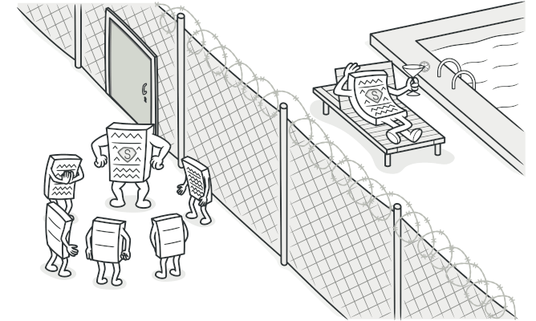

# Classification of Patterns
All patterns can be categorized by their intent, or purpose. The three main groups of patterns:

**Creational patterns** provide object creation mechanisms that increase flexibility and reuse of existing code.

**Structural patterns** explain how to assemble objects and classes into larger structures, while keeping these structures flexible and efficient.

**Behavioral patterns** take care of effective communication and the assignment of responsibilities between objects.

***

## Creational patterns

### Factory Method
**Factory Method** is a creational design pattern that provides an interface for creating objects in a superclass, but allows subclasses to alter the type of objects that will be created.


#### How to implement

1. Make all products follow the same interface. This interface should declare methods that make sense in every product.

2. Add an empty factory method inside the creator class. The return type of the method should match the common product interface.

3. In the creator’s code find all references to product constructors. One by one, replace them with calls to the factory method, while extracting the product creation code into the factory method.

    You might need to add a temporary parameter to the factory method to control the type of returned product.

    At this point, the code of the factory method may look pretty ugly. It may have a large switch statement that picks which product class to instantiate. But don’t worry, we’ll fix it soon enough.

4. Now, create a set of creator subclasses for each type of product listed in the factory method. Override the factory method in the subclasses and extract the appropriate bits of construction code from the base method.

5. If there are too many product types and it doesn’t make sense to create subclasses for all of them, you can reuse the control parameter from the base class in subclasses.

    For instance, imagine that you have the following hierarchy of classes: the base Mail class with a couple of subclasses: AirMail and GroundMail; the Transport classes are Plane, Truck and Train. While the AirMail class only uses Plane objects, GroundMail may work with both Truck and Train objects. You can create a new subclass (say TrainMail) to handle both cases, but there’s another option. The client code can pass an argument to the factory method of the GroundMail class to control which product it wants to receive.

6. If, after all of the extractions, the base factory method has become empty, you can make it abstract. If there’s something left, you can make it a default behavior of the method.

***

### Abstract Factory
**Abstract Factory** is a creational design pattern that lets you produce families of related objects without specifying their concrete classes.

> *If there is only one variant use Factory Method.*
>
>*If there are multiple variants use Abstract Factory.*


#### How to implement
1. Map out a matrix of distinct product types versus variants of these products.

2. Declare abstract product interfaces for all product types. Then make all concrete product classes implement these interfaces.

3. Declare the abstract factory interface with a set of creation methods for all abstract products.

4. Implement a set of concrete factory classes, one for each product variant.

5. Create factory initialization code somewhere in the app. It should instantiate one of the concrete factory classes, depending on the application configuration or the current environment. Pass this factory object to all classes that construct products.

6. Scan through the code and find all direct calls to product constructors. Replace them with calls to the appropriate creation method on the factory object.

***

### Factory Comparison
1. #### Factory
Factory is an ambiguous term that stands for a function, method or class that supposed to be producing something. Most commonly, factories produce objects. But they may also produce files, records in databases, etc.

For instance, any of these things may be casually referenced as a “factory”:

a function or method that creates a program’s GUI;
a class that creates users;
static method that calls a class constructor in a certain way;
one of the creational design patterns.
Usually, when someone says a word “factory,” the exact meaning is supposed to be clear from a context. But if you’re in doubt, just ask. There’s a chance that the author is ignorant.

2. #### Creation method
Creation method defined in the Refactoring To Patterns book as “a method that creates objects.” This means that every result of a factory method pattern is a “creation method” but not necessarily the reverse. It also means that you can substitute the term “creation method” wherever Martin Fowler uses the term “factory method” in Refactoring and wherever Joshua Bloch uses the term “static factory method” in Effective Java.

In reality, the creation method is just a wrapper around a constructor call. It may just have a name that better expresses your intentions. On the other hand, it may help to isolate your code from changes to the constructor. It could even contain some particular logic that would return existing objects instead of creating new.

A lot of people would call such methods “factory method” just because it produces new objects: The logic is straightforward: the method creates objects and since all factories creates objects, this method should clearly be a factory method. Naturally, there’s a lot of confusion when it comes to the real Factory Method pattern.

In the following example, `next` is a creation method:
```php
class Number {
    private $value;

    public function __construct($value) {
        $this->value = $value;
    }

    public function next() {
        return new Number ($this->value + 1);
    }
}
```

3. #### Static creation (or factory) method
Static creation method is a creation method declared as `static`. In other words, it can be called on a class and doesn’t require an object to be created.

Don’t be confused when someone calls methods like this a “static factory method”. That’s just a bad habit. The Factory Method is a design pattern that relies on inheritance. If you make it `static`, you can no longer extend it in subclasses, which defeats the purpose of the pattern.

When a static creation method returns new objects it becomes an alternative constructor.

It might be useful when:

You have to have several different constructors that have different purposes but their signatures match. For instance, having both `Random(int max)` and `Random(int min)` is impossible in Java, C++, C#, and many other languages. And the most popular workaround is to create several static methods that call the default constructor and set appropriate values afterward.

You want to reuse existing objects, instead of instancing new ones (see, the Singleton pattern). Constructors in most programming languages have to return new class instances. The static creation method is a workaround to this limitation. Inside a static method, your code can decide whether to create a fresh instance by calling the constructor or return an existing object from some cache.

In the following example, the `load` method is a static creation method. It provides a convenient way to retrieve users from a database.
```php
class User {
    private $id, $name, $email, $phone;

    public function __construct($id, $name, $email, $phone) {
        $this->id = $id;
        $this->name = $name;
        $this->email = $email;
        $this->phone = $phone;
    }

    public static function load($id) {
        list($id, $name, $email, $phone) = DB::load_data('users', 'id', 'name', 'email', 'phone');
        $user = new User($id, $name, $email, $phone);
        return $user;
    }
}
```

4. #### Simple factory
The Simple factory pattern  describes a class that has one creation method with a large conditional that based on method parameters chooses which product class to instantiate and then return.

People usually confuse simple factories with a general factories or with one of the creational design patterns. In most cases, a simple factory is an intermediate step of introducing Factory Method or Abstract Factory patterns.

A simple factory is usually represented by a single method in a single class. Over time, this method might become too big, so you may decide to extract parts of the method to subclasses. Once you do it several times, you might discover that the whole thing turned into the classic factory method pattern.

By the way, if you declare a simple factory `abstract`, it doesn’t magically become the abstract factory pattern.

Here’s an example of simple factory:
```php
class UserFactory {
    public static function create($type) {
        switch ($type) {
            case 'user': return new User();
            case 'customer': return new Customer();
            case 'admin': return new Admin();
            default:
                throw new Exception('Wrong user type passed.');
        }
    }
}
```

5. #### Factory Method pattern
The Factory Method  is a creational design pattern that provides an interface for creating objects but allows subclasses to alter the type of an object that will be created.

If you have a creation method in base class and subclasses that extend it, you might be looking at the factory method.
```php
abstract class Department {
    public abstract function createEmployee($id);

    public function fire($id) {
        $employee = $this->createEmployee($id);
        $employee->paySalary();
        $employee->dismiss();
    }
}

class ITDepartment extends Department {
    public function createEmployee($id) {
        return new Programmer($id);
    }
}

class AccountingDepartment extends Department {
    public function createEmployee($id) {
        return new Accountant($id);
    }
}
```

6. #### Abstract Factory pattern
The Abstract Factory  is a creational design pattern that allows producing families of related or dependent objects without specifying their concrete classes.

What are the "families of objects"? For instance, take this set of classes: `Transport` + `Engine` + `Controls`. There might be several variants of these:

1. `Car` + `CombustionEngine` + `SteeringWheel`
2. `Plane` + `JetEngine` + `Yoke`

If your program doesn’t operate with product families, then you don’t need an abstract factory.

And again, a lot of people mix-up the abstract factory pattern with a simple factory class declared as `abstract`. Don’t do that!

***

### Builder
**Builder** is a creational design pattern that lets you construct complex objects step by step. The pattern allows you to produce different types and representations of an object using the same construction code.


#### How to implement
1. Make sure that you can clearly define the common construction steps for building all available product representations. Otherwise, you won’t be able to proceed with implementing the pattern.

2. Declare these steps in the base builder interface.

3. Create a concrete builder class for each of the product representations and implement their construction steps.

    Don’t forget about implementing a method for fetching the result of the construction. The reason why this method can’t be declared inside the builder interface is that various builders may construct products that don’t have a common interface. Therefore, you don’t know what would be the return type for such a method. However, if you’re dealing with products from a single hierarchy, the fetching method can be safely added to the base interface.

4. Think about creating a director class. It may encapsulate various ways to construct a product using the same builder object.

5. The client code creates both the builder and the director objects. Before construction starts, the client must pass a builder object to the director. Usually, the client does this only once, via parameters of the director’s class constructor. The director uses the builder object in all further construction. There’s an alternative approach, where the builder is passed to a specific product construction method of the director.

6. The construction result can be obtained directly from the director only if all products follow the same interface. Otherwise, the client should fetch the result from the builder.


***

### Prototype
**Prototype** is a creational design pattern that lets you copy existing objects without making your code dependent on their classes.


#### How to implement

1. Create the prototype interface and declare the clone method in it. Or just add the method to all classes of an existing class hierarchy, if you have one.

2. A prototype class must define the alternative constructor that accepts an object of that class as an argument. The constructor must copy the values of all fields defined in the class from the passed object into the newly created instance. If you’re changing a subclass, you must call the parent constructor to let the superclass handle the cloning of its private fields.

    If your programming language doesn’t support method overloading, you won’t be able to create a separate “prototype” constructor. Thus, copying the object’s data into the newly created clone will have to be performed within the clone method. Still, having this code in a regular constructor is safer because the resulting object is returned fully configured right after you call the new operator.

3. The cloning method usually consists of just one line: running a new operator with the prototypical version of the constructor. Note, that every class must explicitly override the cloning method and use its own class name along with the new operator. Otherwise, the cloning method may produce an object of a parent class.

4. Optionally, create a centralized prototype registry to store a catalog of frequently used prototypes.

    You can implement the registry as a new factory class or put it in the base prototype class with a static method for fetching the prototype. This method should search for a prototype based on search criteria that the client code passes to the method. The criteria might either be a simple string tag or a complex set of search parameters. After the appropriate prototype is found, the registry should clone it and return the copy to the client.

    Finally, replace the direct calls to the subclasses’ constructors with calls to the factory method of the prototype registry.

***

## Singleton
**Singleton** is a creational design pattern that lets you ensure that a class has only one instance, while providing a global access point to this instance.


#### How to implement
1. Add a private static field to the class for storing the singleton instance.

2. Declare a public static creation method for getting the singleton instance.

3. Implement “lazy initialization” inside the static method. It should create a new object on its first call and put it into the static field. The method should always return that instance on all subsequent calls.

4. Make the constructor of the class private. The static method of the class will still be able to call the constructor, but not the other objects.

5. Go over the client code and replace all direct calls to the singleton’s constructor with calls to its static creation method.


***

## Structural patterns

### Adapter
**Adapter** is a structural design pattern that allows objects with incompatible interfaces to collaborate.


#### How to implement
1. Make sure that you have at least two classes with incompatible interfaces:

    - A useful service class, which you can’t change (often 3rd-party, legacy or with lots of existing dependencies).
    - One or several client classes that would benefit from using the service class.
2. Declare the client interface and describe how clients communicate with the service.

3. Create the adapter class and make it follow the client interface. Leave all the methods empty for now.

4. Add a field to the adapter class to store a reference to the service object. The common practice is to initialize this field via the constructor, but sometimes it’s more convenient to pass it to the adapter when calling its methods.

5. One by one, implement all methods of the client interface in the adapter class. The adapter should delegate most of the real work to the service object, handling only the interface or data format conversion.

6. Clients should use the adapter via the client interface. This will let you change or extend the adapters without affecting the client code.

***

### Bridge
**Bridge** is a structural design pattern that lets you split a large class or a set of closely related classes into two separate hierarchies—abstraction and implementation—which can be developed independently of each other.


#### How to implement
1. Identify the orthogonal dimensions in your classes. These independent concepts could be: abstraction/platform, domain/infrastructure, front-end/back-end, or interface/implementation.

2. See what operations the client needs and define them in the base abstraction class.

3. Determine the operations available on all platforms. Declare the ones that the abstraction needs in the general implementation interface.

4. For all platforms in your domain create concrete implementation classes, but make sure they all follow the implementation interface.

5. Inside the abstraction class, add a reference field for the implementation type. The abstraction delegates most of the work to the implementation object that’s referenced in that field.

6. If you have several variants of high-level logic, create refined abstractions for each variant by extending the base abstraction class.

7. The client code should pass an implementation object to the abstraction’s constructor to associate one with the other. After that, the client can forget about the implementation and work only with the abstraction object.

***

### Composite 
**Composite** is a structural design pattern that lets you compose objects into tree structures and then work with these structures as if they were individual objects.


#### How to implement
1. Make sure that the core model of your app can be represented as a tree structure. Try to break it down into simple elements and containers. Remember that containers must be able to contain both simple elements and other containers.

2. Declare the component interface with a list of methods that make sense for both simple and complex components.

3. Create a leaf class to represent simple elements. A program may have multiple different leaf classes.

4. Create a container class to represent complex elements. In this class, provide an array field for storing references to sub-elements. The array must be able to store both leaves and containers, so make sure it’s declared with the component interface type.

    While implementing the methods of the component interface, remember that a container is supposed to be delegating most of the work to sub-elements.

5. Finally, define the methods for adding and removal of child elements in the container.

    Keep in mind that these operations can be declared in the component interface. This would violate the Interface Segregation Principle because the methods will be empty in the leaf class. However, the client will be able to treat all the elements equally, even when composing the tree.

***

### Decorator
**Decorator** is a structural design pattern that lets you attach new behaviors to objects by placing these objects inside special wrapper objects that contain the behaviors.


#### How to implement

1. Make sure your business domain can be represented as a primary component with multiple optional layers over it.

2. Figure out what methods are common to both the primary component and the optional layers. Create a component interface and declare those methods there.

3. Create a concrete component class and define the base behavior in it.

4. Create a base decorator class. It should have a field for storing a reference to a wrapped object. The field should be declared with the component interface type to allow linking to concrete components as well as decorators. The base decorator must delegate all work to the wrapped object.

5. Make sure all classes implement the component interface.

6. Create concrete decorators by extending them from the base decorator. A concrete decorator must execute its behavior before or after the call to the parent method (which always delegates to the wrapped object).

7. The client code must be responsible for creating decorators and composing them in the way the client needs.

***

### Facade
Facade is a structural design pattern that provides a simplified interface to a library, a framework, or any other complex set of classes.


#### How to implement
1. Check whether it’s possible to provide a simpler interface than what an existing subsystem already provides. You’re on the right track if this interface makes the client code independent from many of the subsystem’s classes.

2. Declare and implement this interface in a new facade class. The facade should redirect the calls from the client code to appropriate objects of the subsystem. The facade should be responsible for initializing the subsystem and managing its further life cycle unless the client code already does this.

3. To get the full benefit from the pattern, make all the client code communicate with the subsystem only via the facade. Now the client code is protected from any changes in the subsystem code. For example, when a subsystem gets upgraded to a new version, you will only need to modify the code in the facade.

4. If the facade becomes too big, consider extracting part of its behavior to a new, refined facade class.

***

### Flyweight
**Flyweight** is a structural design pattern that lets you fit more objects into the available amount of RAM by sharing common parts of state between multiple objects instead of keeping all of the data in each object.


#### How to implement
1. Divide fields of a class that will become a flyweight into two parts:

    - the intrinsic state: the fields that contain unchanging data duplicated across many objects
    - the extrinsic state: the fields that contain contextual data unique to each object

2. Leave the fields that represent the intrinsic state in the class, but make sure they’re immutable. They should take their initial values only inside the constructor.

3. Go over methods that use fields of the extrinsic state. For each field used in the method, introduce a new parameter and use it instead of the field.

4. Optionally, create a factory class to manage the pool of flyweights. It should check for an existing flyweight before creating a new one. Once the factory is in place, clients must only request flyweights through it. They should describe the desired flyweight by passing its intrinsic state to the factory.

5. The client must store or calculate values of the extrinsic state (context) to be able to call methods of flyweight objects. For the sake of convenience, the extrinsic state along with the flyweight-referencing field may be moved to a separate context class.

***

### Proxy
**Proxy** is a structural design pattern that lets you provide a substitute or placeholder for another object. A proxy controls access to the original object, allowing you to perform something either before or after the request gets through to the original object.



#### How to implement
1. If there’s no pre-existing service interface, create one to make proxy and service objects interchangeable. Extracting the interface from the service class isn’t always possible, because you’d need to change all of the service’s clients to use that interface. Plan B is to make the proxy a subclass of the service class, and this way it’ll inherit the interface of the service.

2. Create the proxy class. It should have a field for storing a reference to the service. Usually, proxies create and manage the whole life cycle of their services. On rare occasions, a service is passed to the proxy via a constructor by the client.

3. Implement the proxy methods according to their purposes. In most cases, after doing some work, the proxy should delegate the work to the service object.

4. Consider introducing a creation method that decides whether the client gets a proxy or a real service. This can be a simple static method in the proxy class or a full-blown factory method.

5. Consider implementing lazy initialization for the service object.

***

## Behavioral patterns

### Chain of Responsibility
**Chain of Responsibility** is a behavioral design pattern that lets you pass requests along a chain of handlers. Upon receiving a request, each handler decides either to process the request or to pass it to the next handler in the chain.


#### How to implement
1. Declare the handler interface and describe the signature of a method for handling requests.

    Decide how the client will pass the request data into the method. The most flexible way is to convert the request into an object and pass it to the handling method as an argument.

2. To eliminate duplicate boilerplate code in concrete handlers, it might be worth creating an abstract base handler class, derived from the handler interface.

    This class should have a field for storing a reference to the next handler in the chain. Consider making the class immutable. However, if you plan to modify chains at runtime, you need to define a setter for altering the value of the reference field.

    You can also implement the convenient default behavior for the handling method, which is to forward the request to the next object unless there’s none left. Concrete handlers will be able to use this behavior by calling the parent method.

3. One by one create concrete handler subclasses and implement their handling methods. Each handler should make two decisions when receiving a request:

    - Whether it’ll process the request.
    - Whether it’ll pass the request along the chain.

4. The client may either assemble chains on its own or receive pre-built chains from other objects. In the latter case, you must implement some factory classes to build chains according to the configuration or environment settings.

5. The client may trigger any handler in the chain, not just the first one. The request will be passed along the chain until some handler refuses to pass it further or until it reaches the end of the chain.

6. Due to the dynamic nature of the chain, the client should be ready to handle the following scenarios:

    - The chain may consist of a single link.
    - Some requests may not reach the end of the chain.
    - Others may reach the end of the chain unhandled.

***

### Command
**Command** is a behavioral design pattern that turns a request into a stand-alone object that contains all information about the request. This transformation lets you pass requests as a method arguments, delay or queue a request’s execution, and support undoable operations.


#### How to implement
1. Declare the command interface with a single execution method.

2. Start extracting requests into concrete command classes that implement the command interface. Each class must have a set of fields for storing the request arguments along with a reference to the actual receiver object. All these values must be initialized via the command’s constructor.

3. Identify classes that will act as senders. Add the fields for storing commands into these classes. Senders should communicate with their commands only via the command interface. Senders usually don’t create command objects on their own, but rather get them from the client code.

4. Change the senders so they execute the command instead of sending a request to the receiver directly.

5. The client should initialize objects in the following order:

    - Create receivers.
    - Create commands, and associate them with receivers if needed.
    - Create senders, and associate them with specific commands.

***

### Iterator
**Iterator** is a behavioral design pattern that lets you traverse elements of a collection without exposing its underlying representation (list, stack, tree, etc.).


#### How to implement
1. Declare the iterator interface. At the very least, it must have a method for fetching the next element from a collection. But for the sake of convenience you can add a couple of other methods, such as fetching the previous element, tracking the current position, and checking the end of the iteration.

2. Declare the collection interface and describe a method for fetching iterators. The return type should be equal to that of the iterator interface. You may declare similar methods if you plan to have several distinct groups of iterators.

3. Implement concrete iterator classes for the collections that you want to be traversable with iterators. An iterator object must be linked with a single collection instance. Usually, this link is established via the iterator’s constructor.

4. Implement the collection interface in your collection classes. The main idea is to provide the client with a shortcut for creating iterators, tailored for a particular collection class. The collection object must pass itself to the iterator’s constructor to establish a link between them.

5. Go over the client code to replace all of the collection traversal code with the use of iterators. The client fetches a new iterator object each time it needs to iterate over the collection elements.

***

### Mediator
**Mediator** is a behavioral design pattern that lets you reduce chaotic dependencies between objects. The pattern restricts direct communications between the objects and forces them to collaborate only via a mediator object.


#### How to implement
1. Identify a group of tightly coupled classes which would benefit from being more independent (e.g., for easier maintenance or simpler reuse of these classes).

2. Declare the mediator interface and describe the desired communication protocol between mediators and various components. In most cases, a single method for receiving notifications from components is sufficient.

    This interface is crucial when you want to reuse component classes in different contexts. As long as the component works with its mediator via the generic interface, you can link the component with a different implementation of the mediator.

3. Implement the concrete mediator class. Consider storing references to all components inside the mediator. This way, you could call any component from the mediator’s methods.

4. You can go even further and make the mediator responsible for the creation and destruction of component objects. After this, the mediator may resemble a *factory* or a *facade*.

5. Components should store a reference to the mediator object. The connection is usually established in the component’s constructor, where a mediator object is passed as an argument.

6. Change the components’ code so that they call the mediator’s notification method instead of methods on other components. Extract the code that involves calling other components into the mediator class. Execute this code whenever the mediator receives notifications from that component.

***

### Memento
**Memento** is a behavioral design pattern that lets you save and restore the previous state of an object without revealing the details of its implementation.


#### How to implement
1. Determine what class will play the role of the originator. It’s important to know whether the program uses one central object of this type or multiple smaller ones.

2. Create the memento class. One by one, declare a set of fields that mirror the fields declared inside the originator class.

3. Make the memento class immutable. A memento should accept the data just once, via the constructor. The class should have no setters.

4. If your programming language supports nested classes, nest the memento inside the originator. If not, extract a blank interface from the memento class and make all other objects use it to refer to the memento. You may add some metadata operations to the interface, but nothing that exposes the originator’s state.

5. Add a method for producing mementos to the originator class. The originator should pass its state to the memento via one or multiple arguments of the memento’s constructor.

    The return type of the method should be of the interface you extracted in the previous step (assuming that you extracted it at all). Under the hood, the memento-producing method should work directly with the memento class.

6. Add a method for restoring the originator’s state to its class. It should accept a memento object as an argument. If you extracted an interface in the previous step, make it the type of the parameter. In this case, you need to typecast the incoming object to the memento class, since the originator needs full access to that object.

7. The caretaker, whether it represents a command object, a history, or something entirely different, should know when to request new mementos from the originator, how to store them and when to restore the originator with a particular memento.

8. The link between caretakers and originators may be moved into the memento class. In this case, each memento must be connected to the originator that had created it. The restoration method would also move to the memento class. However, this would all make sense only if the memento class is nested into originator or the originator class provides sufficient setters for overriding its state.

***

### Observer
**Observer** is a behavioral design pattern that lets you define a subscription mechanism to notify multiple objects about any events that happen to the object they’re observing.


### How to implement
1. Look over your business logic and try to break it down into two parts: the core functionality, independent from other code, will act as the publisher; the rest will turn into a set of subscriber classes.

2. Declare the subscriber interface. At a bare minimum, it should declare a single update method.

3. Declare the publisher interface and describe a pair of methods for adding a subscriber object to and removing it from the list. Remember that publishers must work with subscribers only via the subscriber interface.

4. Decide where to put the actual subscription list and the implementation of subscription methods. Usually, this code looks the same for all types of publishers, so the obvious place to put it is in an abstract class derived directly from the publisher interface. Concrete publishers extend that class, inheriting the subscription behavior.

    However, if you’re applying the pattern to an existing class hierarchy, consider an approach based on composition: put the subscription logic into a separate object, and make all real publishers use it.

5. Create concrete publisher classes. Each time something important happens inside a publisher, it must notify all its subscribers.

6. Implement the update notification methods in concrete subscriber classes. Most subscribers would need some context data about the event. It can be passed as an argument of the notification method.

    But there’s another option. Upon receiving a notification, the subscriber can fetch any data directly from the notification. In this case, the publisher must pass itself via the update method. The less flexible option is to link a publisher to the subscriber permanently via the constructor.

7. The client must create all necessary subscribers and register them with proper publishers.

***

### State
**State** is a behavioral design pattern that lets an object alter its behavior when its internal state changes. It appears as if the object changed its class.


#### How to implement
1. Decide what class will act as the context. It could be an existing class which already has the state-dependent code; or a new class, if the state-specific code is distributed across multiple classes.

2. Declare the state interface. Although it may mirror all the methods declared in the context, aim only for those that may contain state-specific behavior.

3. For every actual state, create a class that derives from the state interface. Then go over the methods of the context and extract all code related to that state into your newly created class.

    While moving the code to the state class, you might discover that it depends on private members of the context. There are several workarounds:

    - Make these fields or methods public.
    - Turn the behavior you’re extracting into a public method in the context and call it from the state class. This way is ugly but quick, and you can always fix it later.
    - Nest the state classes into the context class, but only if your programming language supports nesting classes.
4. In the context class, add a reference field of the state interface type and a public setter that allows overriding the value of that field.

5. Go over the method of the context again and replace empty state conditionals with calls to corresponding methods of the state object.

6. To switch the state of the context, create an instance of one of the state classes and pass it to the context. You can do this within the context itself, or in various states, or in the client. Wherever this is done, the class becomes dependent on the concrete state class that it instantiates.

***

### Strategy
**Strategy** is a behavioral design pattern that lets you define a family of algorithms, put each of them into a separate class, and make their objects interchangeable.


#### How to implement
1. In the context class, identify an algorithm that’s prone to frequent changes. It may also be a massive conditional that selects and executes a variant of the same algorithm at runtime.

2. Declare the strategy interface common to all variants of the algorithm.

3. One by one, extract all algorithms into their own classes. They should all implement the strategy interface.

4. In the context class, add a field for storing a reference to a strategy object. Provide a setter for replacing values of that field. The context should work with the strategy object only via the strategy interface. The context may define an interface which lets the strategy access its data.

5. Clients of the context must associate it with a suitable strategy that matches the way they expect the context to perform its primary job.

***